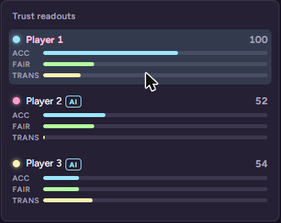
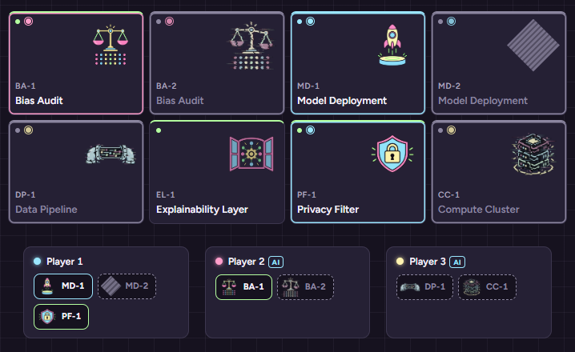
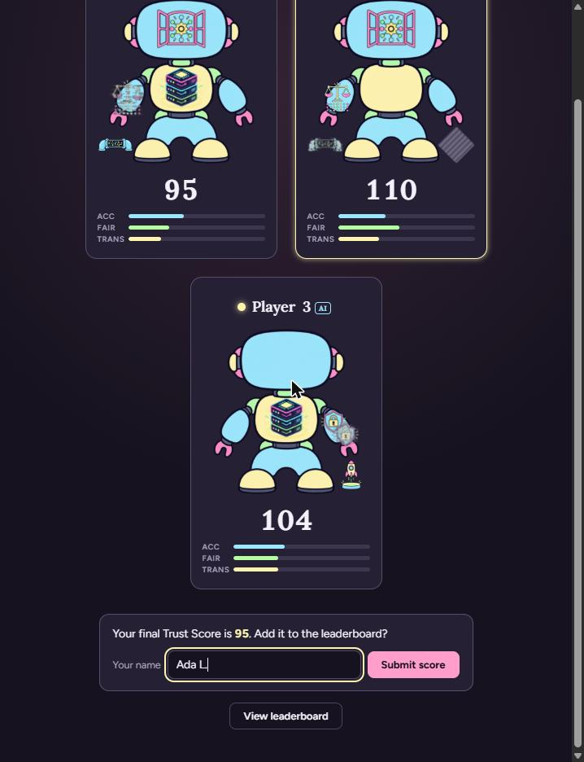
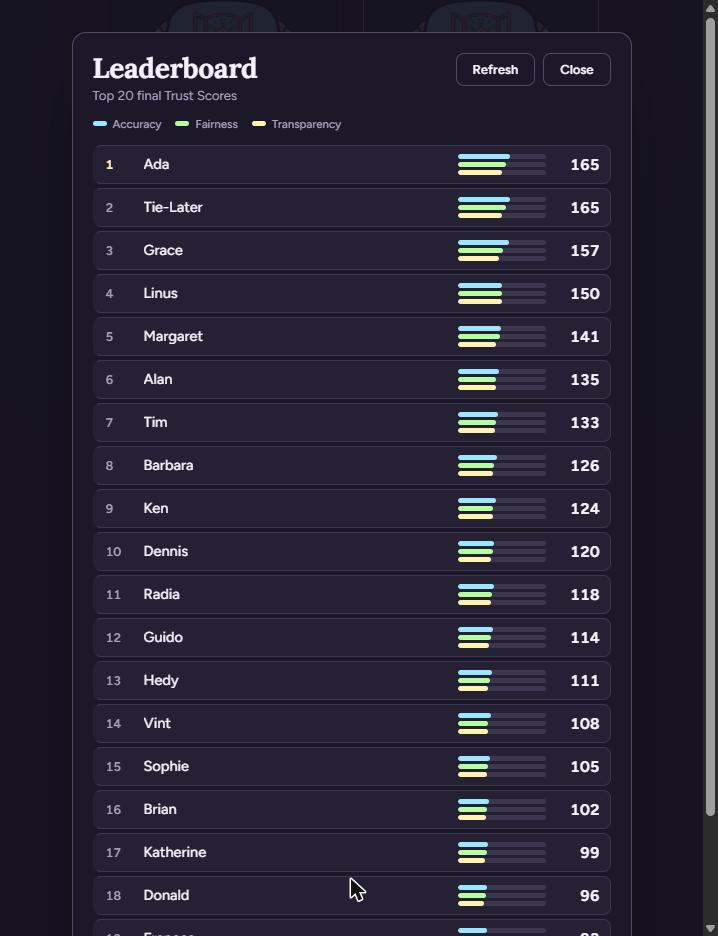

# Build-A-Brain Co. — Technical Documentation

A browser-only React board game about assembling an AI system one module at a
time, while an ethics/accuracy "Trust Score" tracks how responsibly you built
it. No backend, no database — all state lives in memory for the current
browser tab.

This file describes the **current** state of the codebase. It is rewritten
each time it's regenerated, not appended to — see `reports/` for a
day-by-day history of how the project got here.

## Getting started

Requirements: Node.js (any recent LTS) and npm.

```bash
npm install      # install dependencies
npm run dev      # start the Vite dev server (http://localhost:5173)
npm run build    # production build to dist/
npm run lint     # oxlint
```

The game runs with no configuration. The only external service is the
**optional** shared leaderboard — if its two environment variables are unset,
the leaderboard UI simply doesn't appear. To enable it, see
["Leaderboard (optional)"](#leaderboard-optional) below. `.gitignore`
excludes `node_modules`, `dist`/`dist-ssr`, and every `.env*` file except the
committed `.env.example` template.

## File & folder structure

```
index.html                  Vite entry HTML; loads Google Fonts (Lora, Figtree)
vite.config.js               Vite + React plugin config
.oxlintrc.json                Lint rules (React hooks correctness, etc.)
.env.example                  Template for the optional leaderboard's two env vars (copy to .env.local)

supabase/
  leaderboard.sql             One-time database setup for the leaderboard (table + security policies)

src/
  main.jsx                    React root render
  App.jsx                     Top-level layout: <GameBoard /> + <QuizDeckSystem />, plus the
                               standalone "View leaderboard" button when the leaderboard is enabled
  index.css                   Design tokens (palette, fonts) as CSS custom properties, global reset
  App.css                     All component styles (single stylesheet, sections marked off with
                               comment banners: board, tiles, module art, tokens, control panel,
                               trust panel, deck tray, quiz card, model reveal, creature...)

  assets/
    modules/                   Module illustrations: <module-slug>-clean.png / -glitchy.png
    creature/                  chassis-base.png, the robot body the modules mount onto

  data/
    boardData.js               TILES (the 16-space board loop) and INITIAL_PLAYERS
    quizCards.js                Card deck generator — produces MATH_CARDS / ETHICS_CARDS
    gameRules.js                 Tunable balance constants (trust bonuses/penalties, AI odds)
    creatureParts.js              Where each module mounts on the chassis + snap-in order
    moduleArt.js                   Finds the illustration for a module/state by filename (see
                                    "Visual design & assets"); also preloads/decodes images

  constants/
    timing.js                   All animation/pacing durations in one place (ms)

  utils/
    sleep.js                    `sleep(ms)` promise helper used throughout the async turn logic

  lib/
    leaderboard.js              Leaderboard API client (Supabase REST via fetch) + the `leaderboardEnabled` flag

  components/
    GameBoard.jsx                The orchestrator: owns all game state and turn/quiz/trust logic
    Tile.jsx                     One board space (module art, tokens, ownership ring, glitch state)
    PlayerToken.jsx               A player's colored marker on the board, with hop animation
    ControlPanel.jsx               Dice + Roll button + whose-turn indicator
    Dice.jsx                       The digital die readout
    TrustPanel.jsx                 Live per-player Trust Score + 3-axis bar breakdown
    ModuleIcon.jsx                   A module's illustration in its current state (or the CSS
                                      placeholder shape if that image doesn't exist yet)
    ModulesPanel.jsx                Per-player list of owned module chips (clean/glitchy)
    FlyingModuleChip.jsx             The "module flies from tile to panel" acquisition animation
    LandingQuiz.jsx                  The auto-flow quiz overlay used during actual gameplay
    QuizCard.jsx                     The flip-card itself (shared by LandingQuiz and the demo deck)
    QuizOverlay.jsx / QuizDeckSystem.jsx / DeckTray.jsx
                                       Standalone "draw a card and look at it" demo, independent
                                       of board play — the two Math/Ethics deck buttons under the board
    ModelReveal.jsx                   End-of-game screen: builds each player's creature, then
                                       highlights the Trust Score winner
    PlayerCreature.jsx                 Draws the chassis and mounts each owned module on it
    SubmitScore.jsx                    Name field + submit button shown under the finished reveal
    LeaderboardScreen.jsx               Full-screen top-20 list; re-fetches every time it opens

screenshots/                    Current UI screenshots (overwritten on each doc regeneration)
reports/                        One dated markdown file per work session (append-only log)
```

## Core systems

### Board & turn logic (`GameBoard.jsx`, `data/boardData.js`)

The board is a fixed loop of 16 tiles (`TILES`), laid out on a 5×5 CSS grid
with the perimeter as spaces and the center 3×3 area used for the
title/dice/trust UI. Each tile has a `type` (`start`, `module`, `ethics`,
`math`, `pass`) and, for modules, an `ethicsWeight`, `deckKey`, and
`difficultyTier` that decide which quiz card gets drawn there.

A turn (`handleRoll`) is one async sequence:

1. Cycle the dice display randomly, then settle on a real 1–6 result.
2. Move the active player's token one tile at a time (`STEP_PAUSE_MS` apart)
   — this is what makes movement "hop" instead of teleport.
3. Pulse-highlight the landing tile.
4. Resolve the landing (`resolveLanding`):
   - **Unowned module** → draw a card, then acquire on correct answer
     (with the fly-to-panel animation) or apply a trust penalty on wrong.
   - **Own module** → a "follow-up" draw; wrong flips the module to
     `glitchy` (visually and in the Trust Score).
   - **Opponent's module** → no card, just a Trust Score transfer (a
     landing fee) between visitor and owner.
   - **Neutral (Ethics/Math) tile** → draw a card for a flat trust swing.
   - **Pass / Start** → no-op.
5. Advance `currentPlayerIndex` to the next player.

All of this reuses the exact same code path for human and AI turns — see
"AI opponent logic" below.

### Quiz deck data model (`data/quizCards.js`)

Each card is:

```js
{ id, deck: 'math' | 'ethics', difficultyTier: 1 | 2 | 3, prompt: '', options: ['', '', '', ''], correctIndex: null }
```

`MATH_CARDS` and `ETHICS_CARDS` are generated as 18 blank placeholders each
(6 per tier) — **no real question content has been written yet**; that's
intentional and left for later. Because `correctIndex` is always `null`
right now, `GameBoard.jsx` falls back to a coin flip to decide correctness
for human players, and to the tier-weighted AI odds for AI players (see
below). Once real `correctIndex` values are filled in, both paths
automatically switch to grading the actual selected answer — no code
changes needed.

### Trust Score formula (`data/gameRules.js`, `GameBoard.jsx`)

```
Trust Score = accuracy + fairness + transparency
```

Each of the three axes is tracked independently per player and animated
live in `TrustPanel.jsx` (and again in `ModelReveal.jsx` at game end):

- **Accuracy** — the universal signal. Moves on every module quiz result
  (any module type) and every Math-deck neutral draw.
- **Fairness** — moves (in addition to accuracy) specifically on Bias
  Audit module quizzes, on every Ethics-deck neutral draw, and is the axis
  debited when a player pays a landing fee on an *irresponsible*
  (negative-`ethicsWeight`) opponent module.
- **Transparency** — moves (in addition to accuracy) only on
  Explainability Layer module quizzes.
- **Landing fees** scale with `|ethicsWeight| × LANDING_FEE_MULTIPLIER` and
  transfer trust from visitor to owner on the axis matching the module
  (irresponsible → Fairness debit / Accuracy credit; responsible → Accuracy
  debit / the module's own bonus axis as credit).

All the point values (bonuses, penalties, the fee multiplier) live in
`gameRules.js` as named constants — tune balance there, not in
`GameBoard.jsx`.

### AI opponent logic (`GameBoard.jsx`, `data/gameRules.js`)

Players 2 and 3 are marked `isAI: true` in `INITIAL_PLAYERS`; Player 1 is
human. For an AI player:

- A `useEffect` keyed on `currentPlayerIndex` waits
  `AI_TURN_START_DELAY_MS`, then calls the exact same `handleRoll()` the
  human's Roll button calls — same dice animation, same hop movement.
- When their quiz card flips face-up, `presentQuiz(..., isAI=true)` waits
  `AI_THINK_MS` and then auto-picks a random option. Correctness is a
  weighted coin flip via `AI_CORRECT_PROBABILITY_BY_TIER` (currently
  70% / 50% / 30% for tiers 1/2/3) — no reasoning, just tier-scaled luck.
- The resolution path (`finishQuiz`) is shared with human answers, so the
  correct/wrong card animation and Trust Score math are identical either
  way; only *how* the answer gets chosen differs.
- The Roll button and card options are disabled/hidden during an AI turn
  (`ControlPanel.jsx`, `QuizCard.jsx`'s `interactive` prop) so the human
  can't interfere with it.

### Game end & Model Reveal (`GameBoard.jsx`, `ModelReveal.jsx`)

A `useEffect` watches `moduleState` and sets `gameOver` the instant every
module tile has a confirmed owner (a wrong answer never counts — the
module has to actually be acquired). Once `gameOver` is true, rolling stops
(both the button and the AI auto-roll effect are guarded) and
`ModelReveal` renders as a full-screen overlay.

The reveal sorts players **ascending by total Trust Score** and builds
each one's creature one module at a time, with a "snap into place"
animation, then shows that player's score and 3-axis bars before moving to
the next player — saving the highest score for last. A creature is the
chassis illustration with each owned module's illustration mounted at its own
point on it (`creatureParts.js`: Explainability Layer on the face screen,
Compute Cluster on the chest, Bias Audit and Privacy Filter on the arms, Data
Pipeline and Model Deployment in the bottom corners); pieces land base-first.
Two copies of the same module type share one mount point, nudged apart. The
sequence waits until every image it needs is decoded so each snap is a
finished picture. Once everyone's revealed, the top-scoring player gets a
highlighted "Winner" badge and a serif announcement line. **Module count has no
bearing on the win condition** — only the final Trust Score does. When the
leaderboard is enabled, the human player's submit form and a "View
leaderboard" button appear beneath the cards once the winner is shown.

### Visual design & assets (`index.css`, `App.css`, `data/moduleArt.js`)

**Palette.** `#16121f` is the dominant dark base (page, panels, and overlays are
that color or slightly lifted tints of it), with four pastel accents that each
carry a meaning: **green `#b4ff9f`** = ethics / responsible / clean / correct,
**blue `#9be7ff`** = math / technical / accuracy, **yellow `#fff3b0`** =
neutral spaces, transparency, highlights and the winner, **pink `#ff9ecb`** =
the primary accent (Roll button, active turn) and penalties. Players are blue
(you), pink, and yellow. A **glitchy** module drains to a flat grey: grey
ring, grey label, dashed grey chip, and a desaturated version of its art.
Everything is defined as tokens at the top of `index.css`.

**Typography.** Two families only. **Lora** (serif) is for titles and
"moments": the game title, "Model Reveal", player names and scores in the
reveal, the winner badge and announcement, the leaderboard title, and the
card-back deck names. Everything functional (buttons, quiz text, panels,
labels, numbers) is sans. Proxima Nova is a commercial font that Google Fonts
doesn't host, so the sans stack is `'Proxima Nova', 'Figtree', ...`: anyone
with Proxima Nova installed gets it, and everyone else gets Figtree from
Google Fonts. To use the real thing, license it (e.g. Adobe Fonts), load it,
and it takes over with no other change. To swap the stand-in, edit `--sans`
and the Google Fonts `<link>` in `index.html`.

**Illustrations.** Module art is looked up **by filename**, never hard-coded:
`moduleArt.js` globs `src/assets/modules/*.png` and matches
`<module-slug>-clean.png` and `<module-slug>-glitchy.png`, where the slug is
the module's label lowercased with dashes (`Bias Audit` becomes `bias-audit`).
A `-glitch` suffix is accepted too, because `data-pipeline-glitch.png` is
spelled that way. The chassis is `src/assets/creature/chassis-base.png`. The art
appears on board tiles (swapping to the glitchy version when a module is
flagged), in the owned-modules chips, on the flying acquisition animation, and
on the Model Reveal creature.

**Missing art never breaks the build.** Because files are globbed, a missing
illustration just makes the lookup return `null`, and `ModuleIcon` draws the
original CSS placeholder shape for that module/state instead. Right now that
applies to `model-deployment-glitchy.png`, which doesn't exist yet: a glitchy
Model Deployment shows a grey striped diamond. Dropping the file into
`src/assets/modules/` is all it takes; no code change.

**Image weight.** The current PNGs are 1254x1254 (0.4-1.3 MB each, about 9 MB
total) but display at 26-70 px. It works, but smaller exports of the same
files (roughly 256-512 px) would load faster, especially on slower devices.

### Leaderboard (optional)

A shared, cross-device top-20 list of final Trust Scores. It uses
[Supabase](https://supabase.com) (Postgres) through its plain REST API, called
with `fetch` from `src/lib/leaderboard.js` — no SDK and no extra npm
dependency. Everything is gated on `leaderboardEnabled`, which is true only
when both `VITE_SUPABASE_URL` and `VITE_SUPABASE_ANON_KEY` are set; without
them, no leaderboard button, form, or screen is ever rendered and the game is
unchanged.

**Setup (one time):**

1. Create a Supabase project (free tier is fine).
2. In the dashboard's SQL Editor, run `supabase/leaderboard.sql`. It creates
   the `leaderboard` table and the Row Level Security policies.
3. Copy `.env.example` to `.env.local` and fill in the project URL and the
   **anon/public** key (Project Settings → API). Restart `npm run dev`.
4. For a deployed site, set the same two variables in your host's build
   settings — Vite inlines them at build time, so changing them requires a
   rebuild.

**How it works:**

- **Submitting** (`SubmitScore.jsx`): after the reveal finishes, the human
  player (the one non-AI player) can enter a name (trimmed, whitespace
  collapsed, max 20 characters) and submit. One row is stored:
  `name`, `accuracy`, `fairness`, `transparency`. The `total` column is a
  database-generated column (`accuracy + fairness + transparency`), so a
  stored total can never disagree with its breakdown. On success the
  leaderboard opens with the player's new row highlighted; on failure the form
  stays put with the name intact so they can retry. The form hides after a
  successful submit, so one game posts at most one score.
- **Viewing** (`LeaderboardScreen.jsx`): fetches
  `order=total.desc,created_at.asc&limit=20` **every time it opens** (and on
  Refresh), so each visit shows current scores from all devices. Ties rank by
  who submitted first. Each row shows the three axis bars using the same
  colors as the in-game Trust panel, with exact values in the row's tooltip.
  Loading, empty, and error (with retry) states are handled. It's reachable
  from the reveal screen and from a "View leaderboard" button under the decks.
- **Security model:** the anon key ships in the browser bundle, so it is
  public by design; the only things protecting the data are the RLS policies
  in `leaderboard.sql` (anyone can read and insert; nobody can update or
  delete) plus its `check` constraints (name length, per-axis 0–1000). Never
  put the `service_role` key in `.env.local`. Known limitation: because
  scores are computed client-side, a determined visitor can submit a made-up
  score — fine for a class project, but a real competitive leaderboard would
  need server-side validation (e.g., a Supabase Edge Function).
- **Verified against a local mock, not a live project:** the client and UI
  were exercised end-to-end against a stand-in server that speaks the same
  REST protocol (auth headers, CORS preflight, ordering/limit, DB
  constraints, 500s, and outage/recovery). It has not yet been run against a
  real Supabase project, so do a quick real submit after setup to confirm the
  keys and policies are right.

### Save / resume

There is currently no save/resume for the game itself. All game state
(`players`, `moduleState`, dice, turn index, etc.) lives in `GameBoard`'s
React `useState`/`useRef` — a page refresh resets the game to its initial
state. The **only** data that persists anywhere is a submitted leaderboard
entry (above), stored remotely in Supabase; nothing is written to
`localStorage`. If in-progress persistence is wanted later, the natural
approach is to serialize `GameBoard`'s state to `localStorage` on change and
rehydrate it on mount.

### Git workflow

The repo is a standard local git repo (`git init`, no submodules). Per the
project's working agreement: saying **"save progress"** or **"commit
this"** means stage everything and commit with a short descriptive
message — no confirmation needed for that specific action. Force-pushes,
history rewrites, and pushes to remote still require an explicit ask.
`.gitignore` covers `node_modules`, `dist`/`dist-ssr`, and `.env*` files.

## Current UI


*The board mid-game: 16-tile loop, illustrated modules with owner-colored
rings, live dice/turn control, and the Trust Score panel.*


*A quiz card flipped face-up during a landing, showing the placeholder
prompt/options and its deck/tier.*


*The live per-player Accuracy / Fairness / Transparency bars.*


*Module states side by side (sample data): owned and clean, glitchy (greyed
art, dashed chip), glitchy with no illustration yet (placeholder shape), and
an open, unowned module.*


*The end-of-game reveal screen — each player's creature assembled from
their owned modules, with the highest Trust Score highlighted as the
winner (shown here with representative sample data, since reaching a real
end-game state requires a full playthrough).*


*With the leaderboard enabled, the human player's submit form appears once
the reveal finishes (sample data).*


*The top-20 leaderboard, fetched fresh each time it opens (sample data from
a local mock backend, not real players).*
