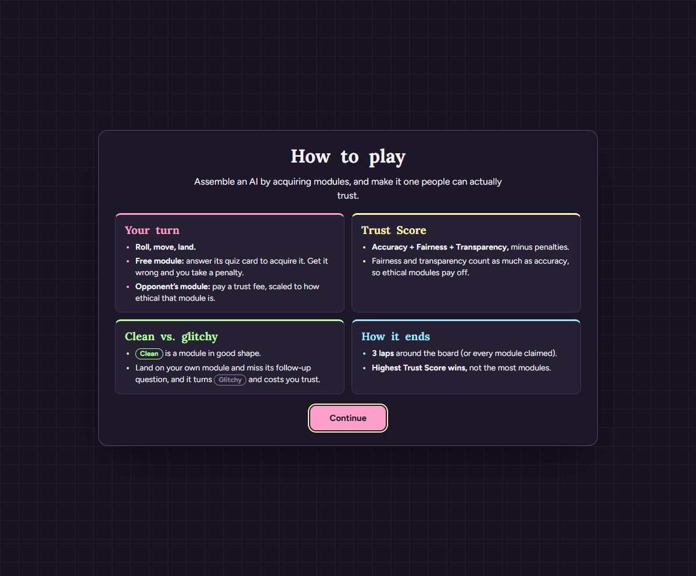
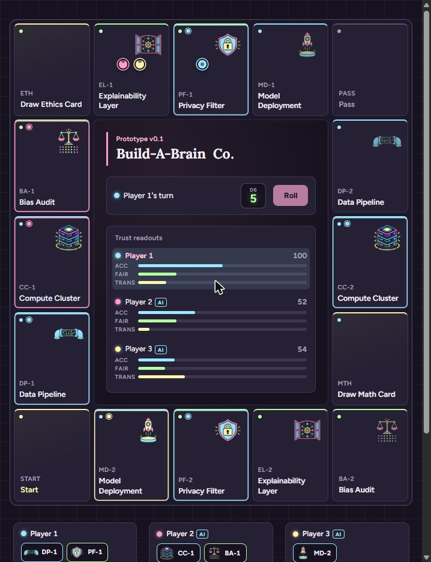
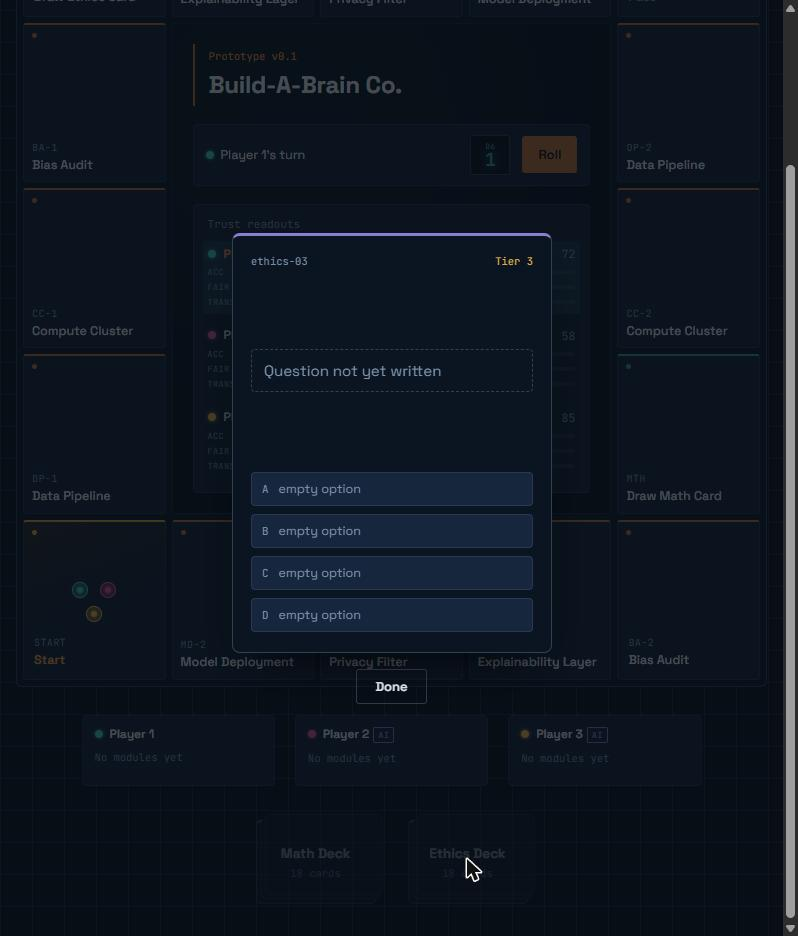
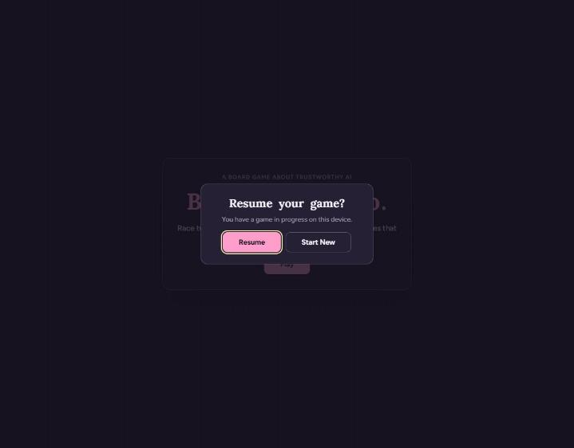
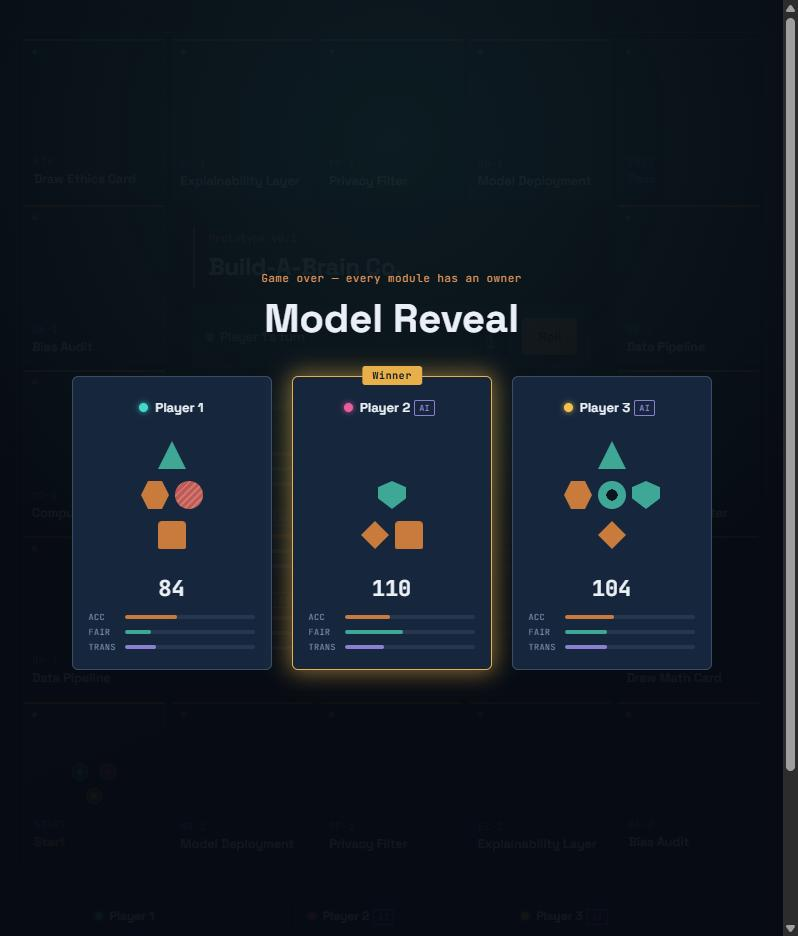

# Daily Report — 2026-09-26

## What was built today
- **Real quiz content:** all 38 questions (20 Ethics, 18 Math) now come from `src/data/quiz-questions.csv`, parsed at startup into the existing card model. Bad rows are skipped with a console warning instead of crashing. The blank-placeholder state is gone. Human answers are now graded against the real `correctIndex`; AI opponents keep their tier-weighted odds but now pick a matching real option, so the card shows a coherent choice.
- **Variable option counts:** the quiz card renders however many options a card has. Ethics cards have 2, Math cards have 4; both were checked in the browser. The card is larger (400 px) and long prompts scroll inside it.
- **Intro flow:** Play → one-screen "How to play" (four short colour-coded sections, Continue) → name entry → game. The old "Prototype v0.1" label became a live "Lap N of 3" counter.
- **Laps:** the game now ends at the close of the first full round in which someone completes 3 laps, or as soon as every module is owned. Highest Trust Score wins.
- **Save / resume:** the full game is saved to `localStorage` after every resolved turn. On load a "Resume your game?" prompt offers Resume or Start New. Resume restores the board exactly (verified: same scores, ownership, glitchy states, and turn) with animations suppressed. The save is cleared at Model Reveal, on Start New, and on Play Again.
- **Play Again:** button on the Model Reveal; resets everything without a reload, keeps the player's name, clears the save.
- **Font decision:** Figtree is the final body/UI font. Documentation updated to say so.
- **Art size:** module PNGs resized to 256 px and the chassis to 512 px, same filenames. Art folder **10.9 MB → 0.9 MB**; whole production build is 1.2 MB. Checked on the live site at all sizes.
- **Deployed** to Vercel: https://build-a-brain-co.vercel.app. Verified on the live URL: intro flow, real cards, autosave, reload → resume prompt → exact restore, a full 3-lap game to the Model Reveal, and Play Again.
- Full `DOCUMENTATION.md` pass; all screenshots retaken from the deployed site.

## Bugs encountered
- **Play Again lost the player's name after a resumed game** (it fell back to "Player 1"). Found while testing the live flow; fixed by taking the name from the saved human player on resume.
- Browser automation timed out on a couple of long scripted playthroughs (45 s tool limit); reran them as short background loops. No app bug.

## Leaderboard go-live (later the same day)
- The Supabase table was created by running `supabase/leaderboard.sql` in the dashboard (the publishable key can't create tables).
- Real submit and fetch tested locally, then on the live site. The first live submit **failed**: the Vercel env values had been added through PowerShell's pipe, which put an invisible BOM at the start of each, and the browser rejects headers containing it. Re-added both values from bash, redeployed, and the live submit and fetch then worked.

## Decisions made
- **Laps rule:** the brief assumed laps existed but the game only ended when every module was owned. I chose 3 laps, ending at the end of a full round so every player gets the same number of turns, plus the early end when all modules are claimed.
- **Play Again skips the intro** and starts straight away with the same name.
- **Leaderboard** first shipped disabled rather than half-tested; it was turned on later the same day once a real Supabase project and keys were available (see below).
- Leaderboard screenshot retaken from the live site (the submit-form screenshot was dropped).

## Known limitations
- **Three test leaderboard rows** ("TEST - delete me", "TEST 2 - delete me", "TEST 3 - delete me") are in the Supabase table from the real-backend checks. The anon key cannot delete rows, so remove them in the Supabase Table Editor.
- Not phone-optimised (board needs ~620 px width).
- Hosted on Vercel under the `sikhay1` Vercel team (display name "Sikhay"), at https://build-a-brain-co.vercel.app.
- Stray 6-byte file `C:\HENRYG~1\placeholder.txt` from an earlier mistake is still there (the environment blocks deleting it); harmless and outside the repo.

## Next session
- Delete the test leaderboard rows.
- Optionally make the layout phone-friendly.

## Completion status
- **Done:** board; dice and movement; real quiz content; turn resolution; Trust Score; AI opponents; laps and game end; Model Reveal; intro/mechanics/name flow; save/resume; Play Again; typography (Figtree final); optimised art; deployment.
- **Leaderboard:** live and verified against a real Supabase project (local and deployed).
- **Git status:** everything committed and pushed to `origin/master` with this report.

## Screenshots (from the deployed site)

