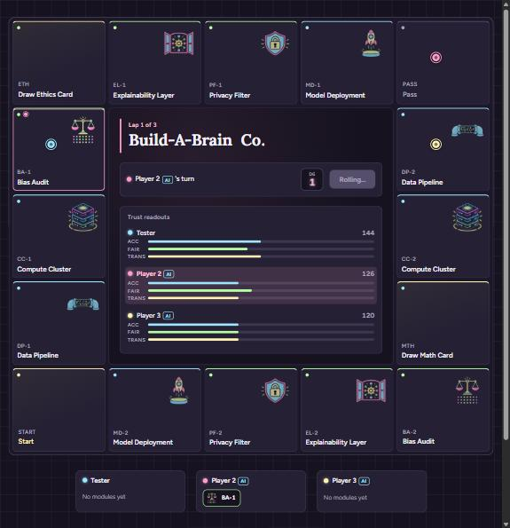
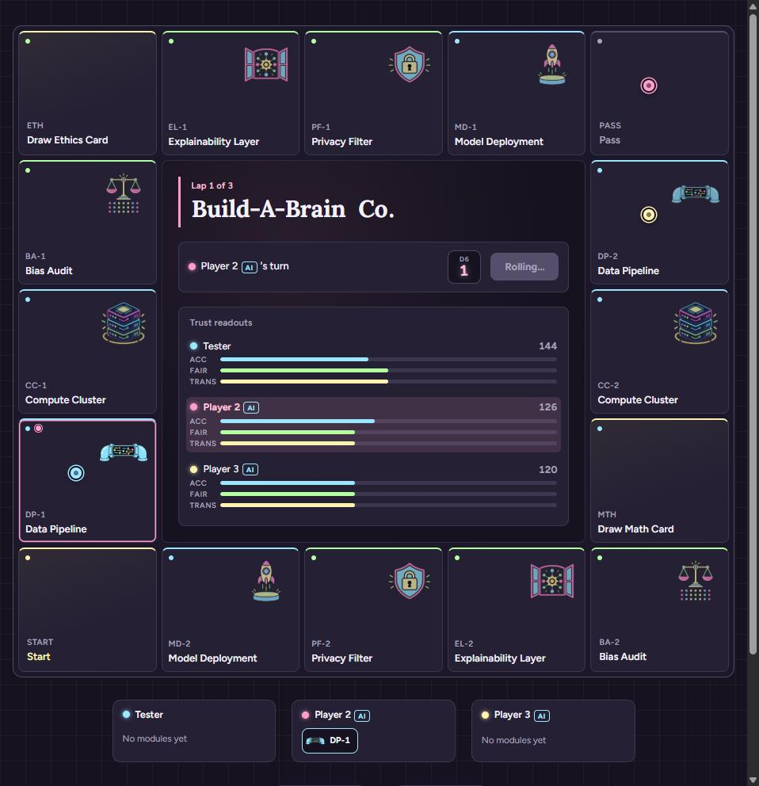
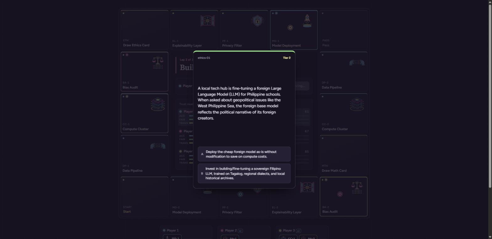

# Daily Report — 2026-09-27

## What was fixed today

**1. Quiz cards repeating within/across rounds.** Every draw — module
acquisition, module follow-up, and neutral Ethics/Math tile draws alike — was
a plain `Math.random()` pick with replacement (`source[Math.floor(Math.random()
* source.length)]`), so the same card could come up again immediately or
anywhere later in the game. Replaced it with one shuffled, no-repeat draw pile
per deck (`src/lib/deckDraw.js`), tracked per deck (Math, Ethics) rather than
per tile or per turn: every card in a deck is dealt exactly once before that
deck reshuffles and starts again. A module tile still prefers the next
remaining card matching its own difficulty tier; if none match, the next card
in the shuffled order is drawn anyway rather than skipped, since every card
still has to be dealt before a reshuffle. The draw piles are now part of the
saved game, so resuming continues the same draw order instead of reshuffling.

**2. Landing-fee axis direction was backwards.** Reported the exact current
logic before changing anything, per the request. The fee's *size* was never
wrong (magnitude is `|ethicsWeight| × 2`, currently 6 either way, since every
module has `|ethicsWeight| = 3` — a separate, already-documented limitation).
The bug was in *which axis moved*: landing on an irresponsible (technical)
opponent module was debiting the visitor's Fairness and crediting the owner's
Accuracy, and landing on a responsible (ethics) module was debiting Accuracy
and crediting the owner's own trust axis — backwards from the theme of each
module type. Confirmed the intended direction, then swapped it: an
irresponsible module now moves a straight Accuracy transfer; a responsible
module moves its own trust axis (Fairness or Transparency), or Fairness if it
has none of its own (Privacy Filter) — same axis on both the visitor's debit
and the owner's credit.

## Scoring values confirmed against the code (no numbers changed)

| Event | Value | Notes |
|---|---|---|
| Acquire a module, correct | **+10** Accuracy, **+10** more to the module's own trust axis if it has one | So **+10 total** for Data Pipeline/Compute Cluster/Model Deployment, **+20 total** for Bias Audit/Explainability Layer — both of your guessed numbers (10 and 20) are right, just for different module types |
| Neutral Ethics/Math tile, correct | **+5** to the tile's axis | Matches your guess exactly |
| Landing fee (paid by visitor to owner) | **6** (`\|ethicsWeight\|=3 × LANDING_FEE_MULTIPLIER=2`) | Matches your guess exactly; direction fixed today (see above) |
| Module flagged "glitchy" | **−4** Accuracy, **−4** more to its own trust axis if it has one, **once**, at the moment it flips | So −4 or −8 total. **There is no ongoing/recurring penalty** for an already-glitchy module — this is a one-time trigger, not a per-turn drain. Flag this if you expected continuous decay; that would be new behavior, not implemented |
| Wrong answer, acquiring a module | **−6** Accuracy, **−6** more from its own trust axis if it has one | So −6 or −12 total — again, both of your guessed numbers are right, for different module types |
| Wrong answer, neutral Ethics/Math tile | **−5** from the tile's axis | Matches your guess exactly |

All values live in `src/data/gameRules.js` as named constants; nothing there
was touched today.

## Issues encountered while fixing them

- None on the core logic. The trickiest part was deciding how "per deck, not
  per turn" should interact with a module tile's difficulty-tier preference;
  resolved it as: prefer a tier match among the cards not yet dealt this
  cycle, but never skip a card outright — the whole deck still empties before
  reshuffling.
- Verifying the landing-fee direction on a real board needed a controlled
  single-step move. Temporarily overriding `Math.random` in the browser
  console (dice always lands on 1) made this deterministic without touching
  any shipped code, on both localhost and the deployed site.

## Live URL status

https://build-a-brain-co.vercel.app — redeployed after both fixes and
confirmed:
- A real playthrough drew 7 different cards across both decks with zero
  repeats (`math-02, math-10, math-15, math-17, math-06, ethics-11,
  ethics-01`).
- Landing on an opponent's Bias Audit moved only Fairness (visitor 50→44,
  owner 40→46); landing on an opponent's Data Pipeline moved only Accuracy
  (visitor 50→44, owner 40→46) — read directly from the Trust panel before
  and after each move.
- Everything from the 2026-09-26 report (3 players, save/resume, Play Again,
  live leaderboard) still works; nothing else changed.

## Completion status

- **Done:** card-repetition fix, landing-fee direction fix, both verified
  locally and on the deployed site; scoring values confirmed against the code;
  docs updated with both fixes and fresh screenshots; deployed.
- **No changes:** the point values in `gameRules.js` — confirmed as-is per
  this session's instructions.
- **Git status:** `92f492a` (the two fixes) is pushed to `origin/master`; this
  report and the doc update are a separate follow-up commit.

## Screenshots (from the deployed site)

